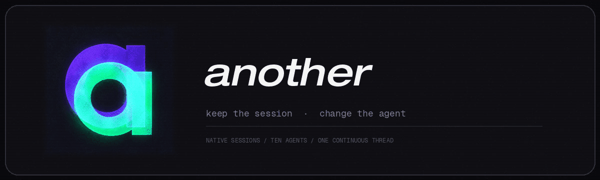
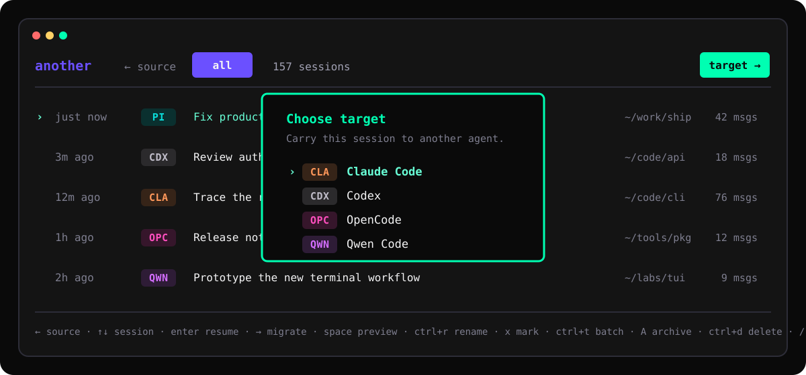
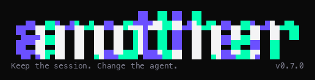

<p align="center">
  <picture>
    <source media="(prefers-reduced-motion: reduce)" srcset="docs/assets/another-motion-static.jpg">
    
  </picture>
</p>

<p align="center">
  <a href="README.md">简体中文</a> · <strong>English</strong>
</p>

<p align="center">
  <a href="https://github.com/nxxxsooo/another/releases"></a>
  <a href="https://github.com/nxxxsooo/another/actions/workflows/ci.yml"></a>
</p>

<p align="center">
  Browse, manage, and resume native coding-agent sessions — or carry one into another agent without replacing it with a summary.
</p>

<p align="center">
  
</p>

You are deep in a session when the model runs out of quota, or the work turns
out to want a different one. The usual escape is to summarize what happened and
paste it somewhere else, which throws away the conversation and asks you to
re-explain it. `another` moves the session itself into the other agent's own
store, so you open it there and keep going.

## Features

- **Native sessions:** resumes in the target agent's own format — not a pasted summary.
- **Ten agents:** Pi, Codex, Claude Code, Cursor, OpenCode, OpenCode 2, CommandCode, Hermes, Qwen Code, and Antigravity.
- **One screen:** browse, search, preview, rename, archive, delete, and migrate without leaving the list.
- **Project-aware:** starts with the current Git project and combines sessions from its main worktree and every registered linked worktree; press `f` to see all projects.
- **Verified migration:** reloads every write, compares a content digest, rolls back on mismatch, and never mutates the source.
- **Local and fast:** reads native local stores; the private SQLite index under `~/.cache/another/` skips unchanged sessions on re-scan.

## Install

macOS and Linux:

```bash
# Homebrew
brew trust nxxxsooo/tap
brew install nxxxsooo/tap/another

# Install script
curl -fsSL https://raw.githubusercontent.com/nxxxsooo/another/main/scripts/install.sh | bash
```

Homebrew 6 requires third-party taps to be trusted before it will load them, and
refuses the install otherwise. Older versions load the tap directly and treat
`brew trust` as an unknown command; skip that line on those.

<details>
<summary><strong>From source</strong></summary>

Go 1.24+:

```bash
go install github.com/nxxxsooo/another/cmd/another@latest
```

</details>

<details>
<summary><strong>Manual download</strong></summary>

Grab a `darwin`/`linux` `amd64`/`arm64` tarball from [Releases](https://github.com/nxxxsooo/another/releases), verify it against `checksums.txt`, and put the binary on your `PATH`:

```bash
shasum -a 256 -c checksums.txt --ignore-missing
tar -xzf another_*_darwin_arm64.tar.gz
install -m 755 another ~/.local/bin/another
```

</details>

With `~/.local/bin` or your Go bin directory on `PATH`, run:

```bash
another
```

The first run opens a Charmtone setup screen. Use `↑↓` to move, `Space` to enable or disable an agent, and `Shift+↑↓` to order agents across the source picker, target picker, and `providers` output, then press `Enter` to continue. The second page picks an optional agent for AI title suggestions; it defaults to off. Run `another setup` any time to change either choice.

### Update

```bash
brew upgrade another                     # Homebrew
curl -fsSL https://raw.githubusercontent.com/nxxxsooo/another/main/scripts/install.sh | bash   # script
go install github.com/nxxxsooo/another/cmd/another@latest                                      # source
```

Outside Homebrew, updates are manual; installed binaries do not follow the repository.

## Use the TUI

```text
Enter     resume the selected session in its native agent
→         migrate the selected session to another agent
←         choose a source agent
↑ / ↓     move through sessions or picker items
Space     preview the conversation
f         switch between the current project and all projects
Ctrl+R    rename in the source agent's native title store
Tab       accept the AI title suggestion, when one is configured and arrives
A         archive; press A again for one-step undo
Ctrl+D    permanently delete after an explicit confirmation
/         search titles and normalized conversation text
r         refresh the local index
Esc       close a picker or dismiss transient state
q         quit
```

Migration shows the exact resume command first. Press `Enter` to hand the terminal to the target agent, `c` to copy the command, or `Esc` to keep browsing.

The TUI starts scoped to the current project. A Git repository's main worktree, every registered linked worktree, and their subdirectories form one project; outside Git, the scope is an exact current-directory match. The header always shows the active scope, and search keeps that scope. An empty project view stays empty rather than silently switching global; press `f` to view all projects.

## Agents

OpenCode and OpenCode 2 are deliberately separate. They use different commands, databases, schemas, and service lifecycles.

| Agent | Provider ID | Native resume | Rename | Archive | Delete |
|---|---|---|:---:|:---:|:---:|
| Pi | `pi` | `pi --session <file>` | ✓ | — | ✓ |
| Codex | `codex` | `codex resume <id>` | ✓ | ✓ | ✓ |
| Claude Code | `claude-code` | `claude --resume <id>` | ✓ | — | ✓ |
| Cursor | `cursor` | `cursor-agent --resume <id>` | — | — | ✓ |
| OpenCode | `opencode` | `opencode --session <id>` | ✓ | ✓ | ✓ |
| OpenCode 2 | `opencode2` | `opencode2 --session <id>` | ✓ | — | ✓ |
| CommandCode | `commandcode` | `commandcode --resume <id>` | — | — | ✓ |
| Hermes | `hermes` | `hermes --resume <id>` | — | ✓ | ✓ |
| Qwen Code | `qwen` | `qwen --resume <id>` | ✓ | — | — |
| Antigravity | `agy` | `agy --conversation <id>` | ✓ | — | — |

A dash means that agent has no verified native contract for the operation. `another` reports the limitation instead of storing a private state that disappears on refresh.

Check the local installation:

```bash
another providers
another providers doctor
```

## AI title suggestions

When setup names an agent, `Ctrl+R` opens the rename box on the original title and asks that agent, in the background, for one title using another's own fixed contract: `MMDD｜类型｜主题` in Chinese or `MMDD｜Type｜Topic` in English. It does not depend on a Skill. The date comes from the indexed creation time converted to `Asia/Shanghai`, never from the model. Suggestions that miss the contract, arrive after the box closes, or fail outright are discarded without touching what you typed. The agent runs in a throwaway directory, so your project's own instructions never reach it.

The second setup page picks the agent and the language; `Enter` opens a third page for the model. That list comes from the agent's own CLI (`pi --list-models`, `agy models`, `opencode models`, `opencode2 models`), typing filters it, the first row leaves the choice to the CLI, and the last row still accepts a name typed by hand. Claude Code, Codex, and Qwen have no listing command, so they go straight to typing with the reason shown — a guessed list of model IDs would only fail later, at rename time.

The second setup page picks the title language with `←→`: **Auto** (default), **English**, or **中文**. Auto uses Chinese when the first meaningful user message contains a Han character and English otherwise. The date and `｜` separator are identical in every language, and the eight types map one to one: 功能/Feature, 设计/Design, 修复/Fix, 优化/Optimize, 发布/Release, 探索/Explore, 文档/Docs, 研究/Research.

For more than one title at a time, mark sessions with `x` and press `Ctrl+T`. A row that fails transiently — a timeout, a rate limit, a CLI that died once — is retried once after two seconds; a missing CLI, an agent that cannot generate titles, or a session without a creation date fails straight to the review page, because a second attempt would print the same line. On the review page `r` re-runs the rows that failed or were cut short by `esc`, keeping the suggestions that already landed. Rows that fail during apply keep their marks, so `Ctrl+T` retries exactly those.

The batch header names the agent, model, and language this run uses, and `m` opens the same picker setup uses.

Generating titles leaves a trace of its own: Codex, Claude Code, Antigravity, and OpenCode record a session for every headless run with no way to opt out. another recognizes those leftovers and keeps them out of the index — the prompt's fixed first line, or the `another-titler-*` throwaway directory the run happened in, identifies them — and evicts any that an older build already indexed. Only another's index is touched; the agent's own session files stay where that agent put them. Once generation finishes or is cancelled, `m` swaps the model for this batch only — empty means that CLI's default — and `Enter` re-runs the same sessions on it. The override is never written back to config: a cheap model for forty old sessions should not become the default for the next single rename.

OpenCode 2 can enforce the same contract during its native first-title request without a second model call; see [`integrations/opencode2-title-policy/`](integrations/opencode2-title-policy/). The Pi session-title patch is under [`integrations/pi-session-title-policy/`](integrations/pi-session-title-policy/). Codex has no stable native title-policy surface yet and remains managed through another.

## CLI

```bash
# Browse and search
another list [--provider ID] [--project PATH] [--cwd] [--limit N] [--json] [--refresh]
another search "query" [--provider ID] [--project PATH] [--cwd] [--limit N] [--json]
another show <session-id> [--provider ID] [--limit N]

# Move a session
another migrate <session-id> --to <provider> [--from ID] [-y]
another migrate <session-id> --to codex --context full -y
another resume <session-id> --to <provider> [--from ID]

# Portable backup
another export <session-id> -o session.another.json
another import session.another.json --to <provider> [--context MODE] [--dry-run] -y

# Configuration and index
another setup
another index update
another index rebuild
```

`--json` makes `list` and `search` emit machine-readable records. Child agent sessions are hidden by default; `--include-subagents` includes them.

Context modes:

- `auto` keeps all cleaned turns when they fit and otherwise selects recent working context;
- `full` preserves every cleaned user/assistant turn even when the destination may compact or reject it;
- `recent` always creates a bounded recent-context view.

## What crosses the boundary

`another` preserves ordered user and assistant text, timestamps when the target supports them, the project directory, title, and a migration marker used for deduplication and verification.

Provider-specific reasoning signatures, tool calls, tool results, images, and system records do not have portable equivalents and are excluded. The original source session is untouched by migration.

OpenCode and OpenCode 2 writes use their official import/API surfaces. Codex Desktop titles come from its GUI title index rather than guessed injected messages. Pi writes complete assistant records with explicit transport metadata and zero-valued usage for reconstructed history.

## Safety

- Every migrated target is reloaded and content-verified before success is reported.
- Failed verification removes only the artifact created by that migration.
- `Ctrl+D` defaults to **Cancel** and shows the provider, title, project, and full session ID.
- Exactly identified active sessions are protected from rename, archive, and delete.
- The configuration directory is mode `0700`; configuration and SQLite index files are mode `0600`.
- Disabling an agent in setup removes only its local index rows, never its native sessions.
- Title suggestions borrow an agent CLI you already authenticated; `another` stores no API keys of its own.
- A suggestion is only ever a suggestion: it is shown next to the rename field, and the rename still needs `Tab` and `Enter`.

## Development

```bash
git clone https://github.com/nxxxsooo/another.git
cd another
make build
go test ./...
go test -race ./...
go vet ./...
```

Regenerate artwork. The rasterized wordmark is checked in, so an ordinary build
never needs a font installed:

```bash
./scripts/render-readme-assets.py                                  # TUI preview SVG
python3 ./scripts/render-motion-banner.py                          # identity banner; Pillow and ffmpeg
python3 ./scripts/render-goodbye-gif.py                            # goodbye GIF; Pillow
python3 ./scripts/render-logo-face.py > internal/tui/logo_face.go  # wordmark; Pillow and JetBrains Mono ExtraBold
```

## The name

The literal meaning comes first: keep the session, continue in **another** agent.

The name is also a quiet nod to [*Another*](https://www.pa-works.jp/works/another/), the 2012 mystery-horror anime from P.A.WORKS based on Yukito Ayatsuji's novel. Its idea of an extra presence whose identity is hard to distinguish became a secondary metaphor for migrated sessions: the same conversational identity appears somewhere else, in another native form. This is conceptual inspiration, not an affiliation or a visual adaptation; the project does not reuse the series' logo, characters, or artwork.

## Acknowledgements

`another` began as a fork of [CyrusSE/agenthop](https://github.com/CyrusSE/agenthop) and is distributed under the MIT License. It now has its own module path, provider contracts, TUI, setup flow, and release surface.

## License

[MIT](LICENSE)

<p align="center">
  <picture>
    <source media="(prefers-reduced-motion: reduce)" srcset="docs/assets/tui-goodbye-static.png">
    
  </picture>
</p>

<p align="center">
  <sub>Quitting leaves this in your scrollback. Handing the terminal to another agent does not.<br>
  <code>ANOTHER_NO_MOTION=1</code>, <code>NO_COLOR</code>, <code>CI</code>, and pipes get the still frame.</sub>
</p>
