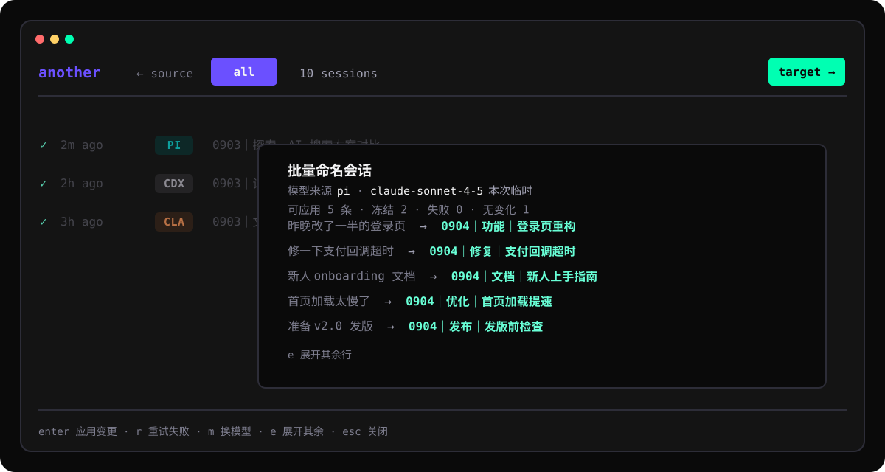

<p align="center">
  <picture>
    <source media="(prefers-reduced-motion: reduce)" srcset="docs/assets/another-motion-static.jpg">
    
  </picture>
</p>

<p align="center">
  <strong>简体中文</strong> · <a href="README.en.md">English</a>
</p>

<p align="center">
  <a href="https://github.com/nxxxsooo/another/releases"></a>
  <a href="https://github.com/nxxxsooo/another/actions/workflows/ci.yml"></a>
</p>

<p align="center">
  在多个 coding agent 之间浏览、管理、迁移并继续真实会话，无需粘贴摘要。
</p>

<p align="center">
  
</p>

模型用完额度，或者当前工作更适合另一个模型时，通常只能总结已有内容，再粘贴到另一端重新解释。`another` 迁移的是会话本身：它把对话写入目标 agent 的原生存储，随后可以在那里直接打开并继续。

## 功能

- **原生会话**：在目标 agent 中按其原生格式恢复，不是粘贴一份摘要。
- **十个 agent**：Pi、Codex、Claude Code、Cursor、OpenCode、OpenCode 2、CommandCode、Hermes、Qwen Code 和 Antigravity。
- **一个界面**：直接浏览、搜索、预览、重命名、归档、删除或迁移会话。
- **项目聚合**：默认只看当前 Git 项目，并把主工作区与所有已登记 worktree 的会话放在一起；按 `f` 可切换到全部项目。
- **迁移后校验**：重新读取每次写入，比较内容摘要；不一致时回滚，来源会话始终保持原样。
- **本地运行**：读取各 agent 的本地原生存储；`~/.cache/another/` 下的私有 SQLite 索引会在重新扫描时跳过未变会话。

## 安装

macOS 和 Linux：

```bash
# Homebrew
brew trust nxxxsooo/tap
brew install nxxxsooo/tap/another

# 安装脚本
curl -fsSL https://raw.githubusercontent.com/nxxxsooo/another/main/scripts/install.sh | bash
```

Homebrew 6 要求先信任第三方 tap，否则会拒绝安装。旧版 Homebrew 不认识 `brew trust`，可跳过这一行，直接安装。

<details>
<summary><strong>从源码安装</strong></summary>

需要 Go 1.24 或更高版本：

```bash
go install github.com/nxxxsooo/another/cmd/another@latest
```

</details>

<details>
<summary><strong>手动下载</strong></summary>

从 [Releases](https://github.com/nxxxsooo/another/releases) 下载对应 `darwin`／`linux`、`amd64`／`arm64` 的压缩包，用 `checksums.txt` 校验后，把二进制文件放到 `PATH`：

```bash
shasum -a 256 -c checksums.txt --ignore-missing
tar -xzf another_*_darwin_arm64.tar.gz
install -m 755 another ~/.local/bin/another
```

</details>

确认 `~/.local/bin` 或 Go bin 目录在 `PATH` 中，然后运行：

```bash
another
```

首次运行会打开 Charmtone 配置界面。按 `↑↓` 移动，按 `Space` 开关 agent，按 `Shift+↑↓` 调整它们在来源、去向和 `providers` 中的顺序，再按 `Enter` 继续。第二页可以选择一个已安装的 agent，用于生成 AI 标题建议，默认关闭。之后可随时运行 `another setup` 修改配置。

### 更新

```bash
brew upgrade another                     # Homebrew
curl -fsSL https://raw.githubusercontent.com/nxxxsooo/another/main/scripts/install.sh | bash   # 安装脚本
go install github.com/nxxxsooo/another/cmd/another@latest                                      # 源码安装
```

Homebrew 之外的安装方式需要手动更新；已安装的二进制不会自动跟随仓库变化。

## 使用 TUI

```text
Enter     用原生 agent 恢复选中的会话
→         把选中的会话迁移到另一个 agent
←         选择来源 agent
↑ / ↓     在会话或选择器条目间移动
Space     预览会话
f         在当前项目和全部项目之间切换
Ctrl+R    在来源 agent 的原生标题存储中重命名
Tab       已配置 AI 标题且建议到达时，接受建议
A         归档；再次按 A 可撤销上一步归档
Ctrl+D    明确确认后永久删除
/         搜索标题和标准化后的会话正文
r         刷新本地索引
Esc       关闭选择器或临时状态
q         退出
```

迁移完成后，界面会先显示准确的恢复命令。按 `Enter` 把终端交给目标 agent，按 `c` 复制命令，或按 `Esc` 留在会话列表。

TUI 默认按当前项目过滤。Git 仓库的主工作区、所有已登记 worktree 及其子目录视为同一项目；非 Git 目录按当前目录精确匹配。顶部始终显示当前范围，搜索也沿用该范围。当前项目没有会话时不会自动跳到全局，按 `f` 即可查看全部。

## 支持的 agent

OpenCode 与 OpenCode 2 是两个独立 provider。它们使用不同的命令、数据库、schema 和服务生命周期。

| Agent | Provider ID | 原生恢复命令 | 重命名 | 归档 | 删除 |
|---|---|---|:---:|:---:|:---:|
| Pi | `pi` | `pi --session <file>` | ✓ | — | ✓ |
| Codex | `codex` | `codex resume <id>` | ✓ | ✓ | ✓ |
| Claude Code | `claude-code` | `claude --resume <id>` | ✓ | — | ✓ |
| Cursor | `cursor` | `cursor-agent --resume <id>` | — | — | ✓ |
| OpenCode | `opencode` | `opencode --session <id>` | ✓ | ✓ | ✓ |
| OpenCode 2 | `opencode2` | `opencode2 --session <id>` | ✓ | — | ✓ |
| CommandCode | `commandcode` | `commandcode --resume <id>` | — | — | ✓ |
| Hermes | `hermes` | `hermes --resume <id>` | — | ✓ | ✓ |
| Qwen Code | `qwen` | `qwen --resume <id>` | ✓ | — | — |
| Antigravity | `agy` | `agy --conversation <id>` | ✓ | — | — |

`—` 表示这个 agent 没有经过验证的原生操作契约。`another` 会直接提示限制，不会维护一份刷新后消失的私有状态。

检查本机安装状态：

```bash
another providers
another providers doctor
```

## AI 标题建议

如果 setup 中指定了 agent，按 `Ctrl+R` 会以原始标题打开重命名框，同时在后台请求该 agent 生成标题。规则由 another 自己执行，不依赖任何 Skill：中文为 `MMDD｜类型｜主题`，英文为 `MMDD｜Type｜Topic`；日期取自索引中的创建时间并转换到 `Asia/Shanghai`，不会交给模型猜测。

setup 第二页选 agent 和语言，按 `Enter` 进第三页选模型：模型列表由该 agent 的 CLI 自己给出（`pi --list-models`、`agy models`、`opencode models`、`opencode2 models`），输入任意字符即时过滤，第一行「默认模型」表示交给 CLI 自己决定，最后一行可以手输一个列表里还没有的模型名。Claude Code、Codex、Qwen 没有列模型的命令，这几个直接进手输，页面会说明原因——列一份猜出来的模型 ID 只会让 `--model` 在重命名时才报错。

setup 第二页用 `←→` 选标题语言：**Auto**（默认）、**English**、**中文**。Auto 看第一条有效用户消息：含汉字就用中文，否则用英文。日期和 `｜` 分隔符在三种语言下都不变；八类语义一一对应：功能／Feature、设计／Design、修复／Fix、优化／Optimize、发布／Release、探索／Explore、文档／Docs、研究／Research。

不符合格式的建议、关闭输入框后才到达的建议和失败请求都会被丢弃，不会覆盖已输入的文字。agent 在临时目录中运行，因此当前项目的指令不会进入标题请求。

需要一次整理多个标题时，用 `x` 标记会话（`a` 切换整页），再按 `Ctrl+T` 批量生成：建议并发产生并实时显示进度，`esc` 取消剩余任务。确认页只列出会变更的行，冻结、失败和无变化折成计数（`e` 展开）；按 `Enter` 应用全部变更，每行都会回读验证。

失败的行会自动重试一次（间隔 2 秒），只针对超时、限流、CLI 崩溃这类瞬时失败；CLI 未安装、该 agent 不能生成标题、缺少创建时间这些重试也不会变的失败直接落到确认页。确认页上按 `r` 重跑仍然失败的行和被 `esc` 中断的行，已经拿到的建议原样保留，不会重新花一次模型调用、也不会换一个新标题。应用阶段失败的行会保留标记，`Ctrl+T` 即可只重试它们。

批量页顶部标明这次用的 agent、模型和语言。生成结束或取消后按 `m` 打开和 setup 同一个模型选择器（同样是 CLI 自己给出的列表，输入过滤，最后一行可手输），`Enter` 用新模型重跑当前这批会话。这个模型不会写回配置：给几十条旧会话选一个便宜的模型，不该变成下次单条重命名的默认。

生成标题时，Codex、Claude Code、Antigravity、OpenCode 这些 CLI 会为每次无头调用留下一条自己的会话，而且没有关掉的开关。另一侧 another 会认出这些残留并挡在索引之外：提示词第一行是固定标记，运行目录是 `another-titler-*` 临时目录，两者任一命中即不入库，之前版本已经入库的也会在下次刷新时清掉。清的只是 another 自己的索引，agent 自己的会话文件仍在它自己的目录里。



OpenCode 2 可以在首次自动命名时直接执行同一规则，而不额外调用一次模型；适配器与安装说明见 [`integrations/opencode2-title-policy/`](integrations/opencode2-title-policy/)。Pi 的 session-title 扩展补丁见 [`integrations/pi-session-title-policy/`](integrations/pi-session-title-policy/)。Codex 暂无稳定的原生标题策略接口，仍由 another 整理。

## CLI

```bash
# 浏览和搜索
another list [--provider ID] [--project PATH] [--cwd] [--limit N] [--json] [--refresh]
another search "query" [--provider ID] [--project PATH] [--cwd] [--limit N] [--json]
another show <session-id> [--provider ID] [--limit N]

# 迁移会话
another migrate <session-id> --to <provider> [--from ID] [-y]
another migrate <session-id> --to codex --context full -y
another resume <session-id> --to <provider> [--from ID]

# 可移植备份
another export <session-id> -o session.another.json
another import session.another.json --to <provider> [--context MODE] [--dry-run] -y

# 配置和索引
another setup
another index update
another index rebuild
```

`list` 和 `search` 加上 `--json` 后会输出机器可读记录。子 agent 会话默认隐藏；加上 `--include-subagents` 可显示。

上下文模式：

- `auto`：清理后的所有轮次能放下时全部保留，否则选择近期工作上下文；
- `full`：保留清理后的全部用户和 assistant 轮次，即使目标端可能压缩或拒绝；
- `recent`：始终生成有长度上限的近期上下文。

## 迁移哪些内容

`another` 会保留按顺序排列的用户和 assistant 文本、目标格式支持的时间戳、项目目录、标题，以及用于去重和校验的迁移标记。

各 provider 特有的 reasoning signature、tool call、tool result、图片和 system record 没有可移植的对等格式，因此不会迁移。来源会话不会被修改。

OpenCode 和 OpenCode 2 通过各自的官方导入／API 接口写入。Codex Desktop 标题来自 GUI 标题索引，不从注入消息中猜测。Pi 写入完整的 assistant 记录，并为重建历史显式设置传输元数据和零值 usage。

## 安全边界

- 每个迁移目标都会重新加载并校验内容，然后才报告成功。
- 校验失败时，只删除本次迁移创建的产物。
- `Ctrl+D` 默认选择 **Cancel**，确认框会显示 provider、标题、项目目录和完整 session ID。
- 能被准确识别的活动会话禁止重命名、归档和删除。
- 配置目录权限为 `0700`，配置文件和 SQLite 索引权限为 `0600`。
- 在 setup 中停用 agent 只会移除本地索引记录，不会删除原生会话。
- 标题建议复用你已认证的 agent CLI；`another` 自身不保存 API key。
- 标题建议只会显示在重命名字段旁，仍需按 `Tab` 接受，再按 `Enter` 提交。

## 开发

```bash
git clone https://github.com/nxxxsooo/another.git
cd another
make build
go test ./...
go test -race ./...
go vet ./...
```

重新生成视觉资产。栅格化字标已经提交到仓库，因此普通构建不需要安装字体。

```bash
./scripts/render-readme-assets.py                                  # TUI 预览 SVG
python3 ./scripts/render-motion-banner.py                          # 品牌横幅，需要 Pillow 和 ffmpeg
python3 ./scripts/render-goodbye-gif.py                            # 退出动效，需要 Pillow
python3 ./scripts/render-logo-face.py > internal/tui/logo_face.go  # 字标，需要 Pillow 和 JetBrains Mono ExtraBold
```

## 名字

字面含义优先：保留当前会话，在 **another** agent 中继续。

这个名字也轻轻借用了 [《Another》](https://www.pa-works.jp/works/another/) 的概念。这部 2012 年悬疑动画由 P.A.WORKS 制作，改编自绫辻行人的小说。作品中那个难以分辨身份的额外存在，给迁移会话提供了第二层隐喻：同一个对话身份会在另一个位置，以另一种原生形式出现。

这里只借用抽象概念，不代表任何关联，也不改编其视觉。项目没有使用动画的 logo、角色或原画。

## 致谢

`another` 起源于 [CyrusSE/agenthop](https://github.com/CyrusSE/agenthop) 的 fork，并按 MIT License 分发。目前已使用独立的 module path、provider 契约、TUI、配置流程和发布体系。

## 许可证

[MIT](LICENSE)

<p align="center">
  <picture>
    <source media="(prefers-reduced-motion: reduce)" srcset="docs/assets/tui-goodbye-static.png">
    
  </picture>
</p>

<p align="center">
  <sub>退出时，字标会留在终端回滚区；把终端交给另一个 agent 时不会显示。<br>
  设置 <code>ANOTHER_NO_MOTION=1</code>、<code>NO_COLOR</code>、<code>CI</code> 或通过 pipe 输出时，使用静止帧。</sub>
</p>
